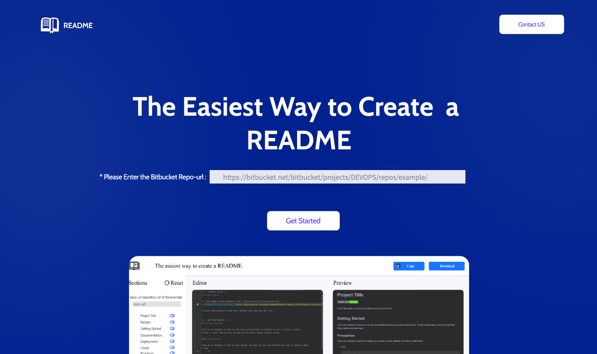
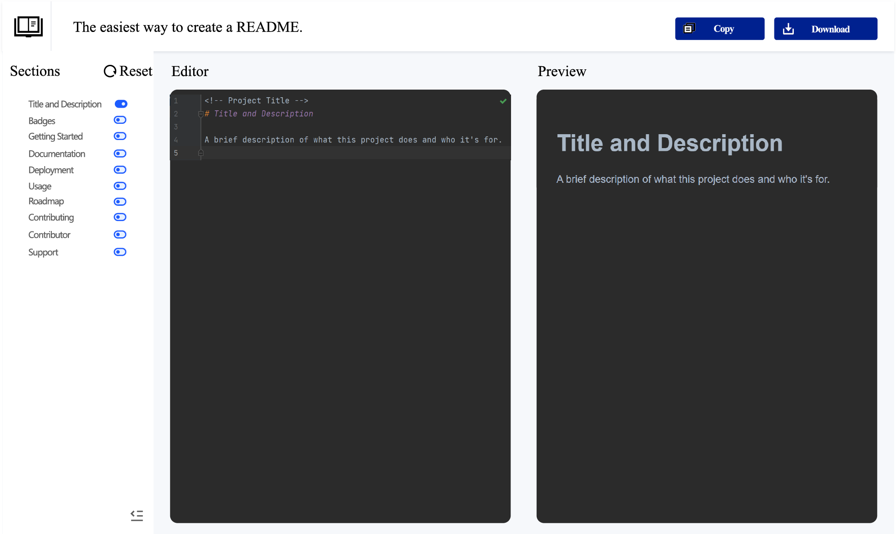
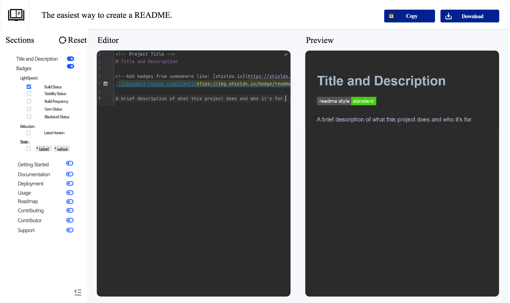
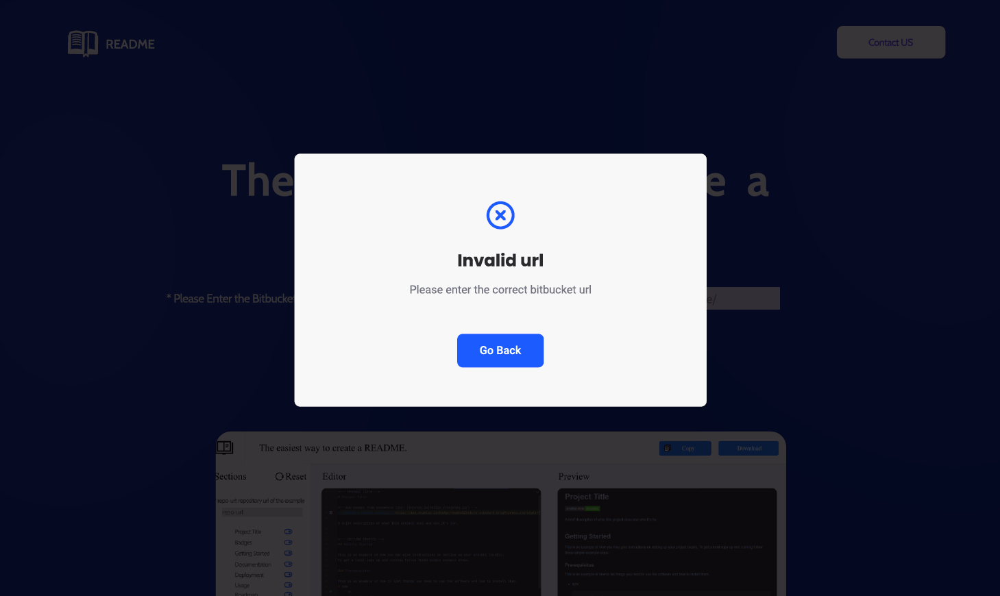

## UI Workflow
There are 2 steps for one user to use the RAAS and generate a README.md document.

1. Enter the Bitbucket URL
2. Select the sections that the README.md contains

### User Login
UI should show:



**Conditions in login page**

| Items    | Value    | Data Type | Constraint | Data Examples                                                                                                           |
|----------|----------|-----------|------------|-------------------------------------------------------------------------------------------------------------------------|
| repo-url | Not Null | String    | Input      | https://cedt-icg-bitbucket.nam.nsroot.net/bitbucket/projects/GSP-DEVOPS-166569/repos/gsp-pipeline-example-python/browse |

#### API
##### getRepoInfo
###### Request

- Method: **GET**
- URL: `api/v1/repoInfo`
- Params: `NULL`
- Body: `{"url":"https://cedt-icg-bitbucket.nam.nsroot.net/bitbucket/projects/GSP-DEVOPS-166569/repos/gsp-pipeline-example-python/browse"}`

###### Response

- Successful 2××
    ```json
    {
        "code": 200,
        "data": [
            {
                "csi":"166569",
                "lightspeed_project":"GSP-DEVOPS",
                "pipeline":"gsp-pipeline-example-python",
                "bitbucket_project":"GSP-DEVOPS-166569",
                "repo":"gsp-pipeline-example-python"            
            }
        ],
        "message":"ok"
    }
    ```
default UI should show:

when the badges switch is turned on, badges will be added between title and description,
the UI should show:


what we must have in this page:

- checkboxes
  - Sections
    1. [x] Project Title `get data from repoInfo API`
    2. [ ] Badges  `unchecked by default`
    
       Lightspeed:
       1. [ ] Build Status `unchecked by default`
       2. [ ] Stability Status `unchecked by default`
       3. [ ] BuildFrequency `unchecked by default`
       4. [ ] Gem Status `unchecked by default`
       5. [ ] Blackduck Status `unchecked by default`
       
       Bitbucket:
       1. [ ] Latest Version `checked by default`
       
       Static:
       1. [ ] label `input` value `input` color `default value is brightgreen`
    4. [ ] Getting Started
    5. [ ] Documentation
    6. [ ] Deployment
    7. [ ] Usage
    8. [ ] Roadmap
    9. [ ] Contributing
    10. [ ] Contributor
    11. [ ] Support

- buttons
  - copy `get data from UI`
  - download `get data from UI`  

- Client Error 4××
    - 400
     ```json
    {
        "code": 400,
        "data": null,
        "message":"Invalid url"
    }
  ```
UI should show:



 

